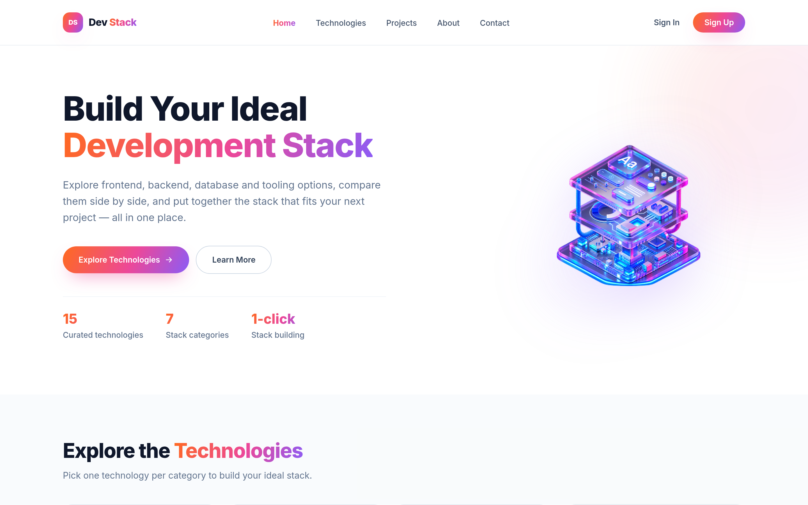
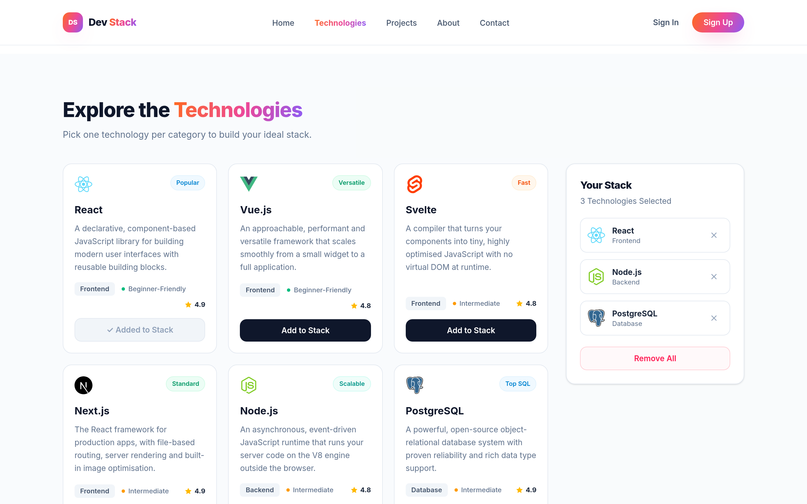
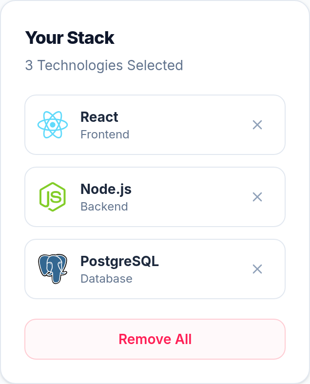
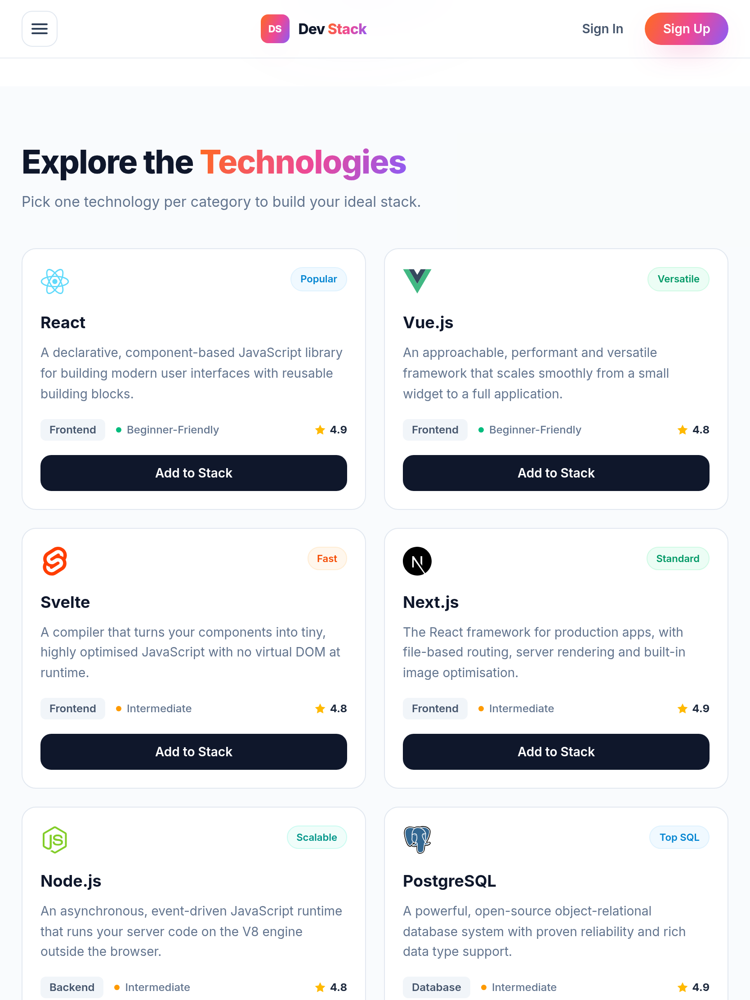
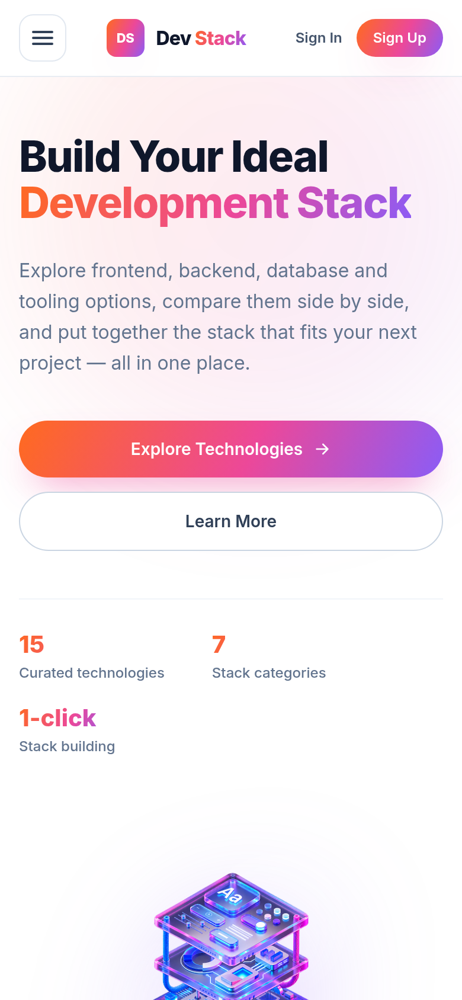
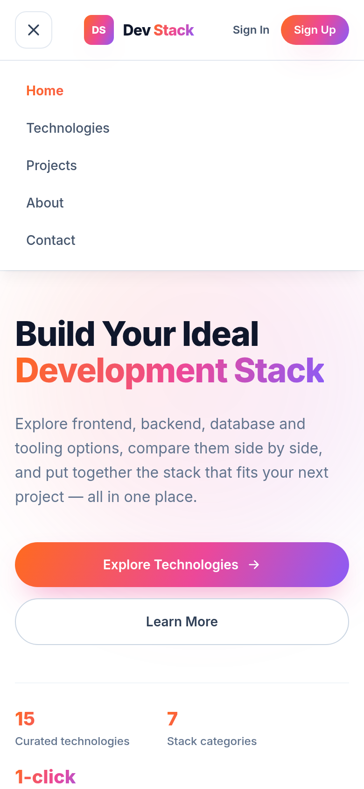
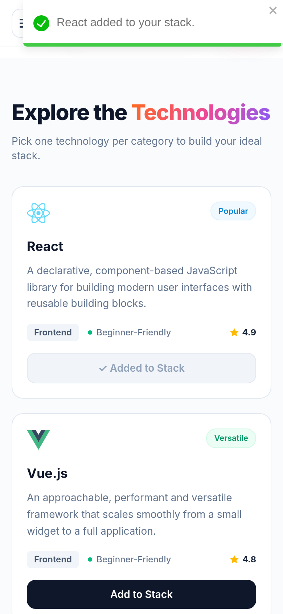

# 🧱 Dev Stack Builder

> Explore frontend, backend, database and DevOps technologies side by side — then put together the stack that fits your next project.

A single-page React app where a visitor browses a curated catalogue of **15 technologies**, filters them by category, adds the ones they like to a personal **"Your Stack"** panel, and gets instant toast feedback for every action. The whole interface is themed from **one shared gradient** (orange → pink → violet) that is defined in a single CSS variable.

**Programming Hero — B14 · Assignment A-05**

<p align="center">
  <a href="https://annoying-anna.github.io/dev-stack-builder/"><b>🚀 Live Site</b></a> ·
  <a href="https://github.com/annoying-anna/dev-stack-builder"><b>📂 Repository</b></a>
</p>

[](https://github.com/annoying-anna/dev-stack-builder/actions/workflows/deploy.yml)


---

## 📸 Screenshots

### Desktop





<table>
  <tr>
    <td width="50%"><b>Your Stack — selected items</b><br /></td>
    <td width="50%"><b>Tablet — 2 column grid</b><br /></td>
  </tr>
</table>

### Mobile

<table>
  <tr>
    <td width="33%"></td>
    <td width="33%"></td>
    <td width="33%"></td>
  </tr>
</table>

> The screenshots above are taken from the deployed build at desktop, tablet and mobile widths.

---

## ✨ Features

1. **Everything renders from one JSON file** — `public/technologies.json` holds 15 technologies across 7 categories (Frontend, Backend, Database, Language, Styling, DevOps, Tools). Nothing is hardcoded in the components; the file is fetched at runtime, so adding a technology means adding a JSON object.
2. **Build your stack with instant feedback** — every *Add to Stack* click pushes the technology into the **Your Stack** sidebar with a live count ("3 Technologies Selected"), each row can be removed with its ✕ button, and **Remove All** clears everything. A duplicate add is blocked and answered with a warning toast instead of silently doing nothing.
3. **Real loading, error and empty states** — while the JSON is being fetched a DaisyUI spinner is shown, a failed request shows a friendly error card with a *Try again* button (retry re-runs the fetch), and an empty result has its own empty state.
4. **One-gradient theming** — the brand name, hero highlight, primary buttons, avatar, hero glow and the active navbar link all read the same `--brand-gradient` variable in `src/index.css`. Change three colour stops and the whole site re-themes itself.
5. **Fully responsive, mockup-accurate layout** — sticky navbar with a hamburger panel on phones, 3-column grid on desktop → 2 on tablet → 1 on mobile, with the Your Stack panel moving below the grid on small screens.
6. **Thoughtful details** — active section tracking in the navbar, sticky stack panel while scrolling, keyboard focus rings, ARIA labels on every icon-only button, lazy-loaded icons, and toasts that never cover the mobile menu.

---

## 🛠️ Tech Stack

| Layer | Choice | Why |
| --- | --- | --- |
| Library | **React 19** (JSX, hooks) | Component model, `useState` / `useEffect` / `useMemo` / `useCallback` |
| Build tool | **Vite 8** | Instant dev server and a small production bundle |
| Styling | **Tailwind CSS v4** (`@tailwindcss/vite`) | Utility-first classes, no config file needed |
| Components | **DaisyUI 5** | Accessible primitives — the loading spinner and the light theme |
| Alerts | **react-toastify 11** | Add / duplicate / remove / remove-all notifications |
| Data | **JSON** (`fetch`) | Technology catalogue served from `/public` |
| CI/CD | **GitHub Actions + GitHub Pages** | Every push to `main` builds and publishes the site |

---

## 📦 Getting Started

```bash
# 1 — clone the repository
git clone https://github.com/annoying-anna/dev-stack-builder.git
cd dev-stack-builder

# 2 — install dependencies
npm install

# 3 — start the dev server (http://localhost:5173)
npm run dev

# 4 — create a production build and preview it
npm run build
npm run preview
```

| Script | Description |
| --- | --- |
| `npm run dev` | Vite dev server with hot module replacement |
| `npm run build` | Production bundle in `dist/` |
| `npm run preview` | Serves the production bundle locally |

### Deployment

Pushing to `main` triggers `.github/workflows/deploy.yml`, which installs with `npm ci`, builds with `VITE_BASE=/dev-stack-builder/` and publishes `dist/` to **GitHub Pages**. The base path is injected from the environment so local development stays on `/`, and `App.jsx` reads `import.meta.env.BASE_URL` when it fetches the JSON — that is what keeps data loading working on a project page such as `/<repository-name>/`.

---

## 🗂 Project Structure

```
B14-A05-DevStack/
├── public/
│   ├── assets/banner-stack.png     # hero illustration
│   ├── favicon.svg                 # gradient "DS" favicon
│   └── technologies.json           # the technology catalogue (15 items)
├── screenshots/                    # README screenshots
├── src/
│   ├── components/
│   │   ├── About.jsx               # about + stat highlights
│   │   ├── Banner.jsx              # hero: heading, copy, CTAs, illustration
│   │   ├── Contact.jsx             # contact form (UI)
│   │   ├── Footer.jsx              # brand block, link groups, bottom bar
│   │   ├── Icons.jsx               # inline SVG icon set
│   │   ├── Loader.jsx              # DaisyUI spinner + loading message
│   │   ├── Logo.jsx                # gradient "DS" badge + wordmark
│   │   ├── Navbar.jsx              # sticky navbar + mobile hamburger panel
│   │   ├── Projects.jsx            # example starter stacks
│   │   ├── TechnologiesSection.jsx # section shell + loading/error/empty states
│   │   ├── TechnologyCard.jsx      # one technology card
│   │   ├── TechnologyGrid.jsx      # responsive card grid (.map + keys)
│   │   └── YourStack.jsx           # the "Your Stack" sidebar
│   ├── App.jsx                     # data fetching + stack state + toasts
│   ├── index.css                   # the shared brand gradient & base styles
│   └── main.jsx                    # entry point
├── .github/workflows/deploy.yml    # GitHub Pages deployment
└── vite.config.js                  # React + Tailwind plugins, base path
```

---

## 🔄 How The Data Flows

```
technologies.json --fetch--> App (useState: technologies / isLoading / error / stack)
                                |
                                v props
                      TechnologiesSection --> TechnologyGrid --> TechnologyCard
                                |                                    |
                                v props                              | onAdd(technology)
                            YourStack <-- stack <--------------------+
                                | onRemove / onRemoveAll
                                v
                            App updates state -> new props flow down -> UI re-renders
```

State lives in **one place** (`App.jsx`) and flows down as props; children report user actions back up through callback props, so there is a single source of truth for the selected stack.

---
## 📊 The JSON Data

`public/technologies.json` — one object per technology:

```json
{
  "id": "react",
  "name": "React",
  "category": "Frontend",
  "description": "A declarative, component-based JavaScript library for building modern user interfaces with reusable building blocks.",
  "icon": "https://icon.icepanel.io/Technology/svg/React.svg",
  "rating": 4.9,
  "difficulty": "Beginner-Friendly",
  "badge": "Popular"
}
```

| Field | Type | Notes |
| --- | --- | --- |
| `id` | string | Unique — used as the React `key` and for the duplicate check |
| `name` | string | Card title and toast text |
| `category` | string | Frontend · Backend · Database · Language · Styling · DevOps · Tools |
| `description` | string | One meaningful sentence (no lorem ipsum) |
| `icon` | string | Remote SVG logo URL |
| `rating` | number | Shown next to a star, e.g. `4.9` |
| `difficulty` | string | Beginner-Friendly · Intermediate · Advanced (drives the coloured dot) |
| `badge` | string | Small pill, e.g. Popular / Fast / Essential / Containers |

**Catalogue:** React, Vue.js, Svelte, Next.js (Frontend) · Node.js (Backend) · PostgreSQL, Redis, MongoDB (Database) · JavaScript, TypeScript, Java (Language) · Tailwind CSS (Styling) · Docker, Kubernetes (DevOps) · Vite (Tools).

---

## 🎨 Theming

Every gradient in the app comes from one variable in `src/index.css`:

```css
:root {
  --brand-start: #ff6a1f;  /* orange */
  --brand-mid:   #ec4899;  /* pink   */
  --brand-end:   #8b5cf6;  /* violet */

  --brand-gradient: linear-gradient(115deg, var(--brand-start), var(--brand-mid) 55%, var(--brand-end));
}
```

Two utility classes wrap it: `.brand-gradient` (painted backgrounds — logo badge, buttons, glow) and `.brand-gradient-text` (gradient text — wordmark, hero highlight, section heading). Change the three stops and the whole UI re-themes.

---

## ♿ Responsiveness & Accessibility

- Breakpoints: `1 column` (below 640px) → `2 columns` (640px+) → `3 columns` (1024px+) with the sidebar beside the grid.
- Verified at **1440×900 desktop, 834×1112 tablet and 375×844 mobile**: no horizontal overflow, `scrollWidth === clientWidth` on mobile, and zero console errors.
- Mobile navbar: hamburger on the left, centred logo, Sign In / Sign Up on the right — the wordmark hides below 360px so nothing overlaps on very narrow phones.
- Icon-only buttons carry `aria-label`s, the menu button exposes `aria-expanded`, the loader uses `role="status"`, and interactive elements keep a visible focus ring for keyboard users.
- Toasts are anchored below the sticky navbar and capped to the viewport width, so they never cover the hamburger button.
- The disabled-looking stack button uses `aria-disabled` + `cursor-not-allowed` instead of the native `disabled` attribute, so a second click still reaches the duplicate guard and explains itself with a warning toast.

---

## ✅ Requirement Checklist

| Requirement | Where it lives |
| --- | --- |
| Navbar: logo + name, centre links, Sign In / Sign Up, sticky | `Navbar.jsx`, `Logo.jsx` |
| Mobile navbar: hamburger · centred logo · auth buttons | `Navbar.jsx` (`grid-cols-[auto_1fr_auto]`) |
| Banner: two-tone heading, description, gradient + outline buttons, image | `Banner.jsx` |
| 10–15 technology JSON objects with all 8 fields | `public/technologies.json` (15) |
| Data loaded from JSON, not hardcoded in a component | `App.jsx` → `fetch(BASE_URL + 'technologies.json')` |
| 3 / 2 / 1 column responsive card grid | `TechnologyGrid.jsx` |
| Card: icon, badge, name, description, category chip, difficulty, rating, button | `TechnologyCard.jsx` |
| "Your Stack" sidebar with heading + selected count | `YourStack.jsx` |
| Empty state message by default | `YourStack.jsx` (ternary on `hasItems`) |
| Add to Stack + duplicate blocked with a warning | `handleAddToStack` in `App.jsx` → `toast.warn` |
| Added button becomes disabled and reads "✓ Added to Stack" | `TechnologyCard.jsx` |
| ✕ removes one item · Remove All clears the stack | `YourStack.jsx` → `handleRemoveFromStack`, `handleRemoveAll` |
| Footer: brand block, 3 link groups, socials, bottom bar | `Footer.jsx` |
| Fully responsive | Tailwind breakpoints in every section |
| react-toastify for add / duplicate / remove / remove-all | `App.jsx` + `<ToastContainer />` |
| Loading state while fetching (+ error and retry states) | `Loader.jsx`, `TechnologiesSection.jsx` |
| One shared gradient for brand, highlight and buttons | `src/index.css` |
| GitHub repository + live deployment | GitHub Actions → GitHub Pages |
| At least 8 meaningful commits | 17 commits, one per logical step |

---
## 🧠 React Concepts — Answers

### 1. What is JSX, and why is it used in React?

JSX is a syntax extension that lets you write HTML-like markup inside a JavaScript file. Every component in this project returns JSX, for example the hero returns `<section id="home">…</section>` and each card returns an `<article>`. Browsers cannot read JSX, so the build tool (Vite) compiles it into plain `React.createElement()` calls.

It is used because the markup and the logic that belongs to it stay together in one readable block, it feels like writing normal HTML, and mistakes such as an unclosed tag or a misspelled attribute are caught while building instead of at runtime.

### 2. What is the difference between props and state?

**Props** are read-only values that a parent passes into a child component. The child can only read them. In this project `TechnologyCard` receives `technology`, `isAdded` and `onAdd` as props, and `YourStack` receives `stack`, `onRemove` and `onRemoveAll`.

**State** is data a component owns and can change over time. `App` owns `stack`, `technologies`, `isLoading` and `error`; `Navbar` owns `isMenuOpen` and `activeSection`.

So props come from outside and must not be changed, while state is created inside a component with `useState` and can be updated with its setter — every update makes React re-render, and the new values then flow down to the children as fresh props.

### 3. What does the `useState` hook do, and where did you use it in this project?

`useState` gives a component a piece of reactive memory. It returns the current value and a setter function:

```jsx
const [stack, setStack] = useState([])
```

Calling the setter schedules a re-render, so the UI always matches the latest value.

Where it is used:

- `App.jsx` — `technologies` (the catalogue), `isLoading`, `error` and `stack`, the four values that drive the whole page.
- `Navbar.jsx` — `isMenuOpen` for the mobile hamburger panel and `activeSection` for the highlighted nav link.

For example `handleAddToStack` calls `setStack((previous) => [...previous, technology])`; the count in the sidebar and the card button both update from that one change.

### 4. What does the `useEffect` hook do, and why did you need it to load the JSON data?

`useEffect` runs side effects *after* React has rendered. Side effects are things that are not pure rendering: fetching data, timers, event listeners on `window`. The dependency array decides when the effect runs again.

Loading the JSON needs it because fetching is asynchronous and has a side effect, and rendering must stay pure. If the fetch ran during render, React would start a new request on every render and loop forever. So `App.jsx` fetches once after the first render:

```jsx
useEffect(() => {
  loadTechnologies()
}, [loadTechnologies])
```

`loadTechnologies` is wrapped in `useCallback` so its identity stays stable and the effect runs once. Inside it the loader is shown, `fetch(BASE_URL + 'technologies.json')` is awaited, and then either `setTechnologies(data)` or `setError(...)` is called — the `isLoading`, `error` and data states all come from that one effect. `Navbar.jsx` uses `useEffect` too, for the `scroll` listener, and removes it again in the cleanup function.

### 5. Why does every item in a `.map()` list need a unique `key` prop?

`key` is how React identifies which rendered element belongs to which item in the array. When the list changes, React compares the keys to decide what to add, remove or reuse. With `key={technology.id}` React can remove exactly the card that was deleted and keep the rest untouched.

Without unique keys React falls back to the item's position: after removing the first item, the remaining nodes are reused and the wrong text can stay on screen (React also prints a warning). Keys must be unique among siblings and stable — here the `id` field from the JSON is used in `TechnologyGrid.jsx` and in the stack list in `YourStack.jsx`.

### 6. What is conditional rendering? Show one place you used it.

Conditional rendering means returning different JSX depending on a condition, using `? :`, `&&` or an early return, instead of changing the DOM by hand.

One example is the empty state of the stack panel in `YourStack.jsx`:

```jsx
{hasItems ? (
  <ul>…the selected technologies…</ul>
) : (
  <div><p>Your stack is empty.</p></div>
)}
```

Other places it is used: `TechnologiesSection.jsx` shows `<Loader />` while loading, an error card with a *Try again* button when the request fails, and otherwise the grid; `TechnologyCard.jsx` switches its button between `Add to Stack` and `✓ Added to Stack`; and the mobile menu panel only renders when `isMenuOpen` is `true`.

### 7. How do you pass data from a parent to a child, and how does a child send something back?

**Parent → child: props.** `App` passes `technologies`, `isLoading`, `error` and the stack callbacks down to `TechnologiesSection`, which forwards what each child needs to `TechnologyGrid`, `TechnologyCard` and `YourStack`.

**Child → parent: a callback prop.** The parent passes a function as a prop, and the child calls it with the data it wants to send up:

```jsx
// parent (App.jsx)
const handleAddToStack = (technology) => { … }
<TechnologiesSection onAdd={handleAddToStack} />

// child (TechnologyCard.jsx)
<button onClick={() => onAdd(technology)}>Add to Stack</button>
```

`TechnologyCard` reports `onAdd(technology)`, `YourStack` reports `onRemove(technology)` and `onRemoveAll()`. Those functions live in `App.jsx`, so the shared state is updated in one place and every component re-renders with the new data — one source of truth, one-directional data flow.

---

## 📤 Submission Links

- **GitHub Repository:** <https://github.com/annoying-anna/dev-stack-builder>
- **Live Site:** <https://annoying-anna.github.io/dev-stack-builder/>

The original assignment brief is kept in [`ASSIGNMENT.md`](./ASSIGNMENT.md) for reference.

---

## 🙌 Credits

- Interface based on the provided UI mockups in [`ui/`](./ui) (design sources: `DevStack.fig`, `DevStack.penpot`).
- Technology logos are loaded from <https://icon.icepanel.io/Technology/svg/>; the hero illustration is the supplied `banner-stack.png` asset.
- Fonts: [Inter](https://fonts.google.com/specimen/Inter) via Google Fonts.
- Built with React, Vite, Tailwind CSS, DaisyUI and react-toastify.

---

<p align="center">Made with ☕ and a lot of <code>useState</code> — Programming Hero · B14 · Assignment A-05</p>
